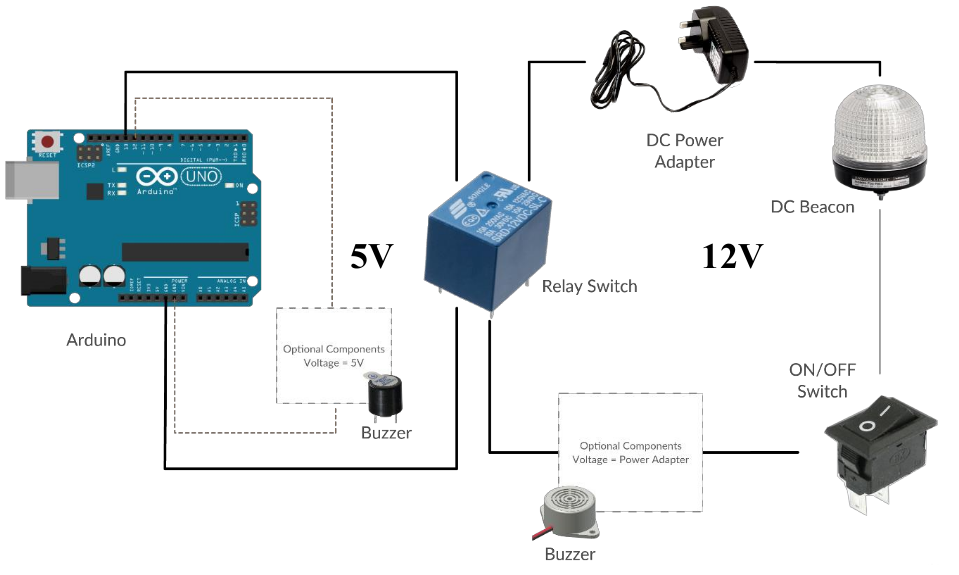

# Core Audio Beacon Project aka Win Audio2Beacon

## History

This is a very old project of mine started in ~2012??  
The idea is to complement the lack of visual alert for a program that produce only sound alert  
It is especially practical for environment where visual is required  
This is a VB application that listen if desktop has sound and sends signal '1' to COM port and to start a process

## Overview

The Core Audio Beacon Project can complements any software that produce sound, as long as the desktop receives it. While the sound is continually getting detected, the visual beacon will light up. It can then serve as a extra alarm/alert.

The Core Audio Beacon Project builds on the desktop sound and send signal over to the microprocessor where it will activate the beacon.

### Architecture Diagram
 

### Software Components
|              |   |
:-------------------------:|:-------------------------:
 |     
Core Audio     |  Arduino IDE/Web Editor 

### Hardware Components
|              |   |  | |
:-------------------------:|:-------------------------:|:-------------------------:|:-------------------------:
 |    |  |    
Arduino     |  Relay Switch  Recommendation: Coiled Voltage/Switch Voltage: < DC 5V  Rated Load: >= (refer to Beacon specifications) |  Beacon  Recommendation: Rated: 12VDC or 24VDC (Do not get VAC/AC) | DC Voltage Power Adapter  Output: (refer to Beacon specifications)  
 |  |  |   
Buzzer | Wire & Breadboard | Soldering Kit | On/Off Switch (SPST)

## Software Installation

### Core Audio
Core Audio is a C# program using Windows Core Audio APIs. The core audio APIs
provide the means for audio applications to access audio endpoint devices such as
headphones and microphones. The core audio APIs serve as the foundation for higher-
level audio APIs such as Microsoft DirectSound and the Windows multimedia waveXxx
functions. Most applications communicate with the higher-level APIs, but some
applications with special requirements might need to communicate directly with the
core audio APIs.

#### Understanding Core Audio Modification
The original core audio sample program can be downloaded at link. The
original project has been tested to work on Window 7 and Window 10.
The original program was modified to include 3 functions:
* A simple user interface to allow user to modify the COM port number and
process name.
* Communication to COM port, so that message can be send out.
* Process checking, to check whether process is currently running.

#### How to Use
1. This is the volume mixer. When sound is detected on the system, green bar will
fall and raise.
2. Input the process to be check. It is important to enter the process name
without .exe extension. Go under Task Manager > Details to find the name of the
process. ( Example notepad.exe = notepad, chrome.exe = chrome )
3. Input the COM port no. of where the Arduino is connected. COM port no. can be
found at Device Manager.
4. This shows the status information of Core Audio. There are 3 types of status;  
   a) “ERROR”: indicates that there is problem establishing connection with  
        
   b) “SUCCESS”: indicates COM port connection is establish and message is send  
        
   c) “NO-PROC”: indicates that processes could not be found  
        
5. Hide minimize Core Audio to tray
6. Save button updates the new values of COM Port and Process. User must
RESTART for new values to take effect.

## Arduino Web Editor/IDE

Make sure Arduino is available to use  
Load code into the Arduino

## Circuit Design
* All the following diagram is design based on 12V specification.
* Circuit Design should be done on breadboard so that configuration can be change
easily.

*NOTE: The beacon can be swapped with a higher voltage, however, ensure matching voltage &
compatibility for the output from power adapter, rated load for relay switch, buzzer and on/off switch

## Debugging

There are 3 types of status;  
a) “ERROR”: indicates that there is problem establishing connection with the COM
port  
   1. Possible Problem:  
        COM port conflict, other program is using the same COM port number  
      Resolution:  
        i. Change the COM port number used by Arduino under Device Manager  
        ii. Update Core Audio with new COM number and restart  
        iii. Restart PC  
   2. Possible Problem:  
        COM port does not exist  
      Resolution:  
        i. Check COM port under Device Manager  
        ii. Restart PC when COM port exist  
   3. Possible Problem:  
        Setting did not take effect of the new value  
      Resolution:  
        i. Ensure setting is correct  
        ii. Restart Core Audio  
b) “NO-PROC”: indicates that processes could not be found   
   1. Possible Problem:  
        Process does not exist  
      Resolution:  
        i. Go to Task Manager
        ii. Ensure process exists  
   2. Possible Problem:  
        Process name is wrong / Process name contain .exe  
      Resolution:  
        i. Go to Task Manager  
        ii. Ensure process exists  
        iii. Enter again the process name with “.exe”
        iv. Restart Core Audio

## Relay Switch with Circuit & Components
1. Setup circuit as shown below
2. Prepare 5V DC Power Adapter or any other alternative 5V Output
3. DO NOT CONNECT the 5V to the relay switch yet 

4. Debug  

## Finalizing
Checklist:  
* Ensure hardware configuration design is finalized  
* Ensure software and code is working  
* Debugging is done and components are working as intended  

Preparation:  
* Soldering item is ready and available  
* PCB is large enough to accommodate all wiring pin and relay switch onboard  

Soldering:  
* Solder based on the diagram below:   
     * Red Cross: Do not solder
     * Blue Circle: Solder
     * Orange Square: Use a wire connector

