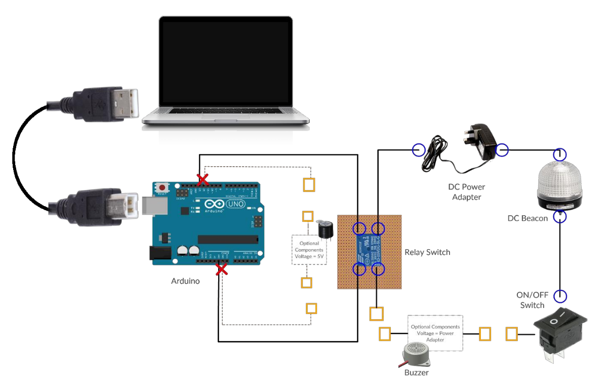

# Core Audio Beacon Project aka Win Audio2Beacon

## History

This is a very old project of mine started in ~2012??
It is a VB application that listen if desktop has sound and sends signal '1' to COM port and to start a process

## Overview

The Core Audio Beacon Project supplements the existing capabilities of any software that produces sound by providing beacon as an phyiscal alarm. The beacon can serve as an extra light and/or sound alarm in addition to sound produce by the software is required.

The Core Audio Beacon Project builds on the alarm sound from any software and send signal over to the microprocessor where it will activate the beacon, thereby alerting.

### Architecture Diagram

### Software Components

### Hardware Components

